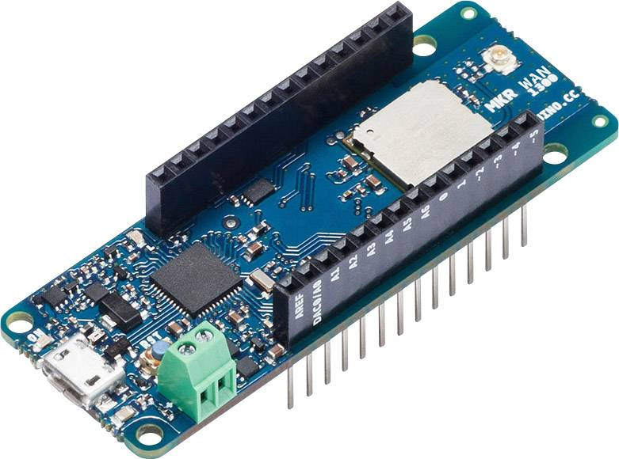
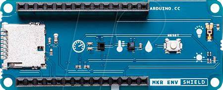

# LoRaWAN_END-Device_SetUP

Welcome to the documentation for setting up a LoRaWAN end device configuration with a gateway and server. This guide will walk you through the steps required to establish communication between LoRaWAN end devices and a backend server through a gateway. This guide will provide you with the necessary information to get started.

## Table of Contents

1. [Introduction to LoRaWAN](#introduction-to-lorawan)
2. [Components](#components)
3. [Prerequisites](#prerequisites)
4. [Setting Up the Gateway](#setting-up-the-gateway)
5. [Configuring the Server](#configuring-the-server)
6. [Programming the End Device](#programming-the-end-device)
7. [Troubleshooting](#troubleshooting)
8. [Resources](#resources)
9. [Contributing](#contributing)
10. [License](#license)

## Introduction to LoRaWAN

LoRaWAN (Long Range Wide Area Network) is a low-power wireless communication protocol designed for long-range communication between devices, gateways, and backend servers. It's particularly suitable for Internet of Things (IoT) applications where devices need to send small packets of data over long distances while conserving battery power.

## Components

This project involves the following components:

- **End Device:** The IoT device that collects or generates data to be transmitted over the LoRaWAN network.
    1. Arduino MKR WAN 1300:
    
    **Specification:**
        - SAMD21 Cortex-M0+ 32bit low power ARM MCU 48 MHz
        - CMWX1ZZABZ LoRa Module
        - Screw terminals for battery
        - 2dB Antenna Power
        - Carrier frequency: 433/868/915 MHz
        - I/O pin current: 7mA
        - 5V pin current: Battery/USB dependent
        - 3.3V pin current: Battery dependent, 600mA from USB 
    
    1.1 Arduino MKR ENV Shield
    

- **Gateway:** An intermediate device that receives data from end devices and forwards it to the backend server.
- **Backend Server:** The server that receives data from the gateways, processes it, and makes it available for further analysis.

## Prerequisites

Before you begin, make sure you have the following:

- Knowledge of programming concepts and basic networking.
- Hardware components: LoRaWAN-capable end device, LoRaWAN gateway, computer for running the server.
- Software: Arduino IDE for end device programming, gateway software (e.g., ChirpStack), and any server-side software.

## Setting Up the Gateway

1. **Choose a Gateway:** Select a LoRaWAN gateway that suits your project requirements.
2. **Hardware Setup:** Follow the manufacturer's instructions to set up the hardware. Connect the gateway to your network and power source.
3. **Gateway Software:** Install and configure gateway software, such as ChirpStack Gateway Bridge.
4. **Gateway Configuration:** Configure the gateway with the appropriate settings, including frequency plan and LoRaWAN network server details.

## Configuring the Server

1. **Choose a LoRaWAN Server:** Decide on a LoRaWAN server platform like ChirpStack or The Things Stack.
2. **Server Setup:** Install and configure the server software on your chosen platform.
3. **Network Setup:** Define your LoRaWAN network, including frequency bands and encryption keys.
4. **Gateway Integration:** Integrate the gateway with the server using provided instructions.

## Programming the End Device

1. **Select a Development Board:** Choose a development board compatible with your LoRaWAN network (e.g., Arduino with LoRa module).
2. **End Device Programming:** Use the Arduino IDE (or other preferred IDE) to program the end device with the appropriate LoRaWAN library.
3. **Configure End Device:** Set the device address, network session key, and application session key as per your LoRaWAN server setup.
4. **Data Transmission:** Write code to collect or generate data and transmit it using the LoRaWAN library.

## Troubleshooting

- **Gateway Issues:** If data is not reaching the server, check gateway connections, configuration, and logs.
- **Server Issues:** Verify server configuration, check logs for error messages, and ensure the server is receiving data from the gateway.
- **End Device Issues:** Double-check end device settings, verify wiring, and review the code for any programming errors.

## Resources

- List any additional resources, tutorials, or documentation links that could be helpful.

## Contributing

If you'd like to contribute to this project, feel free to submit pull requests or raise issues in the GitHub repository.

## License

Specify the license under which your project is released.

---

Feel free to customize this README template according to your project's specific details. Providing clear and concise instructions will help others understand and use your LoRaWAN end device configuration with gateway and server effectively. Good luck with your project!